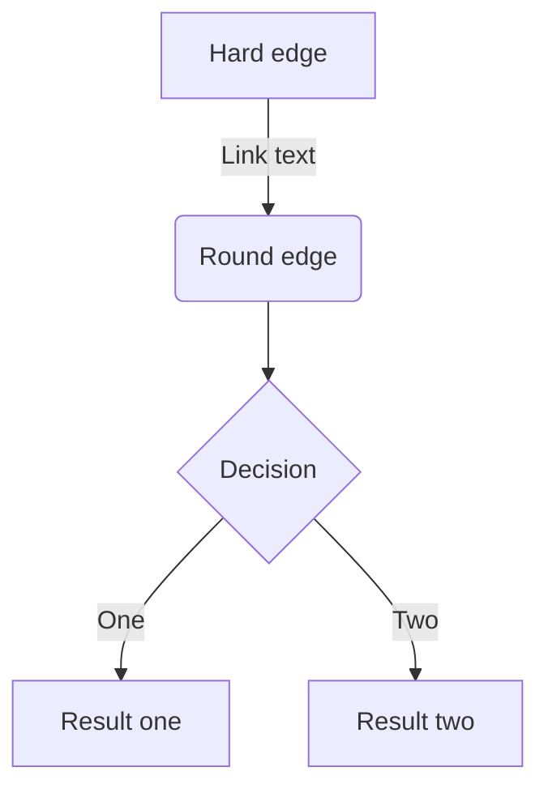

# Zennコンテンツ用Markdownスタンダード

## Zenn Markdownの規約
Zennの公式Markdownガイドに従う: https://zenn.dev/zenn/articles/markdown-guide

## ファイル構造の要件

### 記事のFront Matter（必須）
```yaml
---
title: "記事のタイトル"
emoji: "😸"              # 記事アイコン用の絵文字1文字
type: "tech"             # "tech" または "idea"
topics: ["markdown", "rust", "aws"]  # 関連タグの配列（最大5個）
published: true          # 公開状態（下書きの場合はfalse）
published_at: 2050-06-12 09:03  # オプション: 公開予約日時
---
```

### 本のチャプターFront Matter
```yaml
---
title: "チャプターのタイトル"
free: true              # オプション: 有料本での無料アクセス
---
```

## 基本的なMarkdown記法

### 見出し
```markdown
# 見出し1
## 見出し2
### 見出し3
#### 見出し4
```
- 説明的で階層的なヘッダー（H1-H6）を使用
- 記事全体で一貫したヘッダー構造を維持
- ヘッダーレベルの飛び越し（H1 → H3）を避ける

### リスト
```markdown
- Hello!
- Hola!
  - Bonjour!
  - Hi!

1. First
2. Second
```
- 一貫した箇条書き記号（`-` または `*`）を使用
- 順序付きリストは適切に番号付け（1., 2., 3.）

### テキストスタイル
```markdown
*イタリック*
**太字**
~~打ち消し線~~
`インラインコード`
```
- 強調には**太字**、軽い強調には*斜体*を使用
- 技術用語やコマンドには`インラインコード`を使用

### リンク
```markdown
[アンカーテキスト](リンクのURL)
```
- 説明的なリンクテキストを使用、「ここ」や「これをクリック」を避ける
- 内部コンテンツには相対リンクを優先

## 画像

### 基本的な画像挿入
```markdown

```

### 画像の横幅指定
```markdown

```

### キャプション付き画像
```markdown

*キャプション*
```

### 画像にリンクを貼る
```markdown
[](リンクのURL)
```

- すべての画像にalt textを含める
- 画像にはZennの画像アップロードサービスまたはGitHubリポジトリを使用

## コードブロック

### 基本的なコードブロック
```markdown
```js
const great = () => {
  console.log("Awesome");
};
```
```

### ファイル名付きコードブロック
```markdown
```js:ファイル名
const great = () => {
  console.log("Awesome");
};
```
```

### diff表示
```markdown
```diff js
@@ -4,6 +4,5 @@
+    const foo = bar.baz([1, 2, 3]) + 1;
-    let foo = bar.baz([1, 2, 3]);
```
```

- シンタックスハイライト用に必ず言語を指定
- ファイル内容を表示する際は説明的なファイル名を使用
- 複雑なコード例には日本語でコメントを含める
- 断片的なものより完全で実行可能な例を優先

## 数式（KaTeX）

### ブロック数式
```markdown
$$
e^{i\theta} = \cos\theta + i\sin\theta
$$
```

### インライン数式
```markdown
$a\ne0$
```

## テーブル
```markdown
| Head | Head | Head |
| ---- | ---- | ---- |
| Text | Text | Text |
| Text | Text | Text |
```

## 引用
```markdown
> 引用文
> 引用文
```

## 脚注
```markdown
脚注の例[^1]です。インライン^[脚注の内容その2]で書くこともできます。

[^1]: 脚注の内容その1
```

## Zenn独自の記法

### メッセージボックス
```markdown
:::message
メッセージをここに
:::

:::message alert
警告メッセージをここに
:::
```

### アコーディオン（トグル）
```markdown
:::details タイトル
表示したい内容
:::
```

### ネストした要素
```markdown
::::details タイトル
:::message
ネストされた要素
:::
::::
```

## コンテンツの埋め込み

### リンクカード
```markdown
# URLだけの行
https://zenn.dev/zenn/articles/markdown-guide

# または
@[card](URL)
```

### X（Twitter）のポスト
```markdown
# ポストのURLだけの行
https://twitter.com/jack/status/20
https://x.com/jack/status/20
```

### YouTube
```markdown
# YouTubeのURLだけの行
https://www.youtube.com/watch?v=WRVsOCh907o
```

### GitHub
```markdown
# GitHubのファイルURLまたはパーマリンクだけの行
https://github.com/octocat/Hello-World/blob/master/README

# 行の指定
https://github.com/octocat/Spoon-Knife/blob/main/README.md#L1-L3
```

### その他の埋め込み
```markdown
@[gist](GistのページURL)
@[codepen](ページのURL)
@[slideshare](スライドのkey)
@[speakerdeck](スライドのID)
@[docswell](スライドのURL)
@[jsfiddle](ページのURL)
@[codesandbox](embed用のURL)
@[stackblitz](embed用のURL)
@[figma](ファイルまたはプロトタイプのURL)
@[blueprintue](ページのURL)
```

## ダイアグラム（mermaid.js）

### フローチャート
```markdown

```

### 制限事項
- ブロックあたりの文字数制限: 2000文字以内
- Chain数制限: 10以下
- クリックイベントは無効化

## インラインコメント
```markdown
<!-- TODO: ◯◯について追記する -->
```
- 自分用のメモに使用
- 公開ページでは表示されない
- 複数行のコメントには対応していない

## 言語規約とベストプラクティス
- 主要言語: 日本語
- 一貫した技術用語を使用
- 有用な場合は英語用語を括弧内に含める
- プロフェッショナルで教育的なトーンを維持
- 視覚的魅力のため適切な絵文字を選択
- 発見しやすい関連トピックで記事をタグ付け
